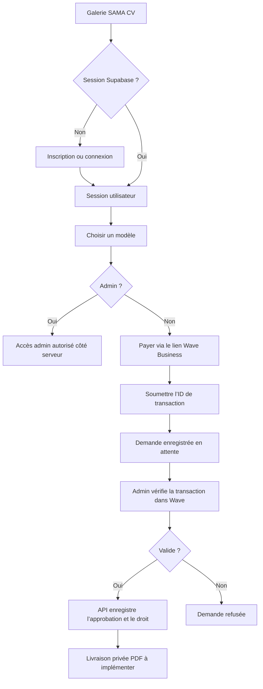

# ARCHITECTURE.md — SAMA CV

## Vue d’ensemble

SAMA CV est actuellement une galerie statique de quatorze modèles HTML éditables. La cible commerciale ajoute des comptes, des droits d’accès, le paiement Wave et un déploiement Vercel/Supabase.

Le navigateur sert à éditer et prévisualiser les CV. Il n’est pas une frontière de sécurité : un modèle livré comme fichier statique peut être récupéré directement. Les contrôles d’accès et l’octroi des achats doivent donc être décidés et appliqués par le backend.

## Flux utilisateur

L’ID saisi par le client n’est jamais une preuve. Le navigateur ne peut ni confirmer une transaction ni accorder un droit : un administrateur authentifié vérifie le paiement dans Wave avant de l’approuver côté serveur. L’automatisation par webhook reste suspendue jusqu’à réception de la documentation officielle Wave.

## Composants

- `index.html` : galerie et points d’entrée connexion/inscription.
- `login.html`, `signup.html` : formulaires natifs utilisant Supabase Auth.
- `assets/auth.js` : gestion de session, chargement des variables publiques et soumission d’une demande de paiement ; aucun secret serveur.
- `api/config.js` : expose uniquement les variables publiques Supabase et le lien Wave validé.
- `payment.html` et `api/payments.js` : paiement par lien Wave configuré puis création d’une demande `pending`, sans autorité client sur l’achat.
- `api/admin/payments.js` : vérifie l’identité et le rôle admin auprès de Supabase, puis permet la validation ou le refus manuel.
- `api/entitlements.js` : vérifie les droits côté serveur.
- `admin.html` : interface de revue manuelle ; l’autorisation est aussi vérifiée côté API.
- `supabase/migrations/001_manual_wave_payments.sql` : paiements en attente, droits par modèle, RLS et fonction transactionnelle de validation.

## Données et autorisations

La migration de départ définit `payments` et `entitlements`. Chaque droit relie un utilisateur à un modèle acheté. Les politiques RLS permettent à un utilisateur de lire ses propres données et interdisent au client de s’attribuer un rôle admin, de confirmer son paiement ou de créer un droit sans validation serveur.

Le rôle admin est attribué hors du parcours d’inscription, par une procédure contrôlée. Une adresse email seule ou une variable JavaScript ne suffit pas à établir ce rôle.

## Paiement Wave manuel

Le lien de paiement est public et le client soumet ensuite un identifiant de transaction. L’API enregistre le montant fixe de 2 000 XOF et l’état `pending` ; elle ne valide jamais automatiquement cet identifiant. Un admin vérifie la transaction dans le tableau de bord Wave Business, puis approuve ou refuse la demande. La fonction SQL verrouille la demande et enregistre le droit de façon atomique.

Le compte Wave et le lien seul ne permettent pas d’implémenter un checkout ou un webhook automatisé. Ne pas inventer les endpoints ou méthodes de signature Wave. Une clé serveur Supabase (`SUPABASE_SERVICE_ROLE_KEY`, `SUPABASE_SECRET_KEY` ou `SUPABASE_SERVICE_KEY`) est nécessaire pour les fonctions de soumission, de droits et d’administration ; elle ne doit jamais être exposée au navigateur.

## Distribution des modèles et PDF

Les fichiers `model1.html` à `model14.html` sont actuellement des fichiers statiques. Les protéger par un contrôle d’interface ou par `protection.js` est impossible : une URL publique permet de les récupérer sans passer par l’interface.

Décision retenue : générer le PDF côté serveur, le conserver dans un stockage privé et ne le remettre qu’au moyen d’un lien signé temporaire. Le serveur devra vérifier le droit d’accès au modèle avant de générer ou délivrer le PDF. Les HTML statiques ne seront pas considérés comme des fichiers privés ou comme une livraison après achat.

Le fournisseur de stockage, la durée de validité du lien et le format des données transmises au générateur restent à définir pendant l’implémentation. L’impression `window.print()` côté client peut rester une fonction de prévisualisation, mais ne prouve pas un achat et ne peut pas empêcher la copie d’un document rendu à l’écran.

## Variables d’environnement attendues

Les noms définitifs dépendront des SDK/API retenus. Les secrets doivent être enregistrés dans Vercel et dans les environnements locaux ignorés par Git, jamais dans les fichiers HTML ou les migrations.

- `NEXT_PUBLIC_SUPABASE_URL` et `NEXT_PUBLIC_SUPABASE_ANON_KEY` (ou `NEXT_PUBLIC_SUPABASE_PUBLISHABLE_KEY`) côté configuration publique Vercel.
- `NEXT_PUBLIC_WAVE_PAYMENT_LINK` pour le lien `https://pay.wave.com/...`.
- `SUPABASE_SERVICE_ROLE_KEY`, `SUPABASE_SECRET_KEY` ou `SUPABASE_SERVICE_KEY` côté fonctions serveur uniquement.
- Identifiants/API key Wave Business côté serveur uniquement.
- Secret de signature webhook si Wave en fournit un.
- URL publique de l’application et URL webhook configurée chez Wave.

## Déploiement

1. Configurer le projet Supabase, les migrations, RLS et le compte admin.
2. Renseigner les variables d’environnement Vercel Preview et Production séparément.
3. Déployer d’abord en Preview avec le sandbox Wave et tester les scénarios de paiement.
4. Vérifier les logs sans données sensibles, les retours webhook et les droits accordés.
5. Passer en Production uniquement après validation explicite des comptes marchand et des tests.