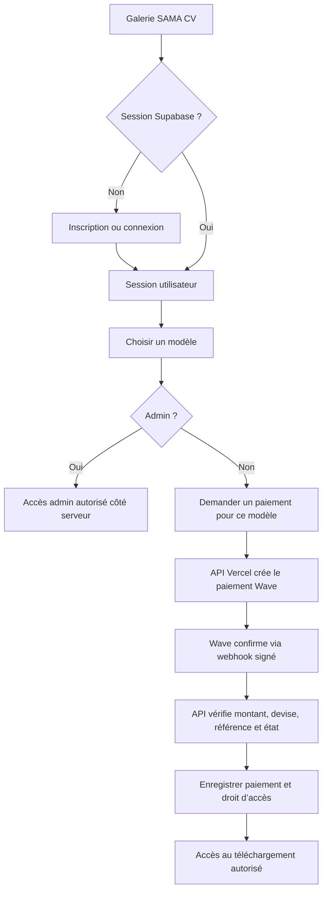

# ARCHITECTURE.md — SAMA CV

## Vue d’ensemble

SAMA CV est actuellement une galerie statique de quatorze modèles HTML éditables. La cible commerciale ajoute des comptes, des droits d’accès, le paiement Wave et un déploiement Vercel/Supabase.

Le navigateur sert à éditer et prévisualiser les CV. Il n’est pas une frontière de sécurité : un modèle livré comme fichier statique peut être récupéré directement. Les contrôles d’accès et l’octroi des achats doivent donc être décidés et appliqués par le backend.

## Flux utilisateur

Le retour du navigateur après paiement n’accorde aucun droit. En cas de retard ou d’absence du webhook, l’interface interroge un endpoint de statut authentifié ; elle ne marque jamais elle-même la transaction comme payée.

## Composants

- `index.html` : galerie et points d’entrée connexion/inscription.
- `login.html`, `signup.html` : formulaires natifs utilisant Supabase Auth.
- `assets/auth.js` : gestion de session et redirection selon l’état authentifié ; aucun secret serveur.
- `payment.html`, `assets/payment.js` : demande de paiement et affichage de son état, sans autorité sur l’achat.
- `api/verify-payment.js` : endpoint serveur de webhook/statut. Il valide la signature selon la documentation Wave, vérifie transaction, modèle, montant, devise et utilisateur, puis écrit de façon idempotente.
- `admin.html` : interface d’administration protégée aussi par les contrôles serveur et RLS ; masquer une page par JavaScript ne constitue pas une autorisation.
- `supabase/migrations.sql` : profils, rôle, commandes/paiements, droits par modèle, contraintes et politiques RLS.
- `vercel.json` : routes, en-têtes et configuration de déploiement sans secrets.

## Données et autorisations

La conception minimale cible des tables `profiles`, `payments` et `entitlements` (noms à confirmer avant migration). Chaque droit relie un utilisateur à un modèle acheté. Les politiques RLS doivent permettre à un utilisateur de lire ses propres données et interdire au client de s’attribuer un rôle admin, de confirmer son paiement ou de créer un droit sans validation serveur.

Le rôle admin est attribué hors du parcours d’inscription, par une procédure contrôlée. Une adresse email seule ou une variable JavaScript ne suffit pas à établir ce rôle.

## Paiement Wave

La fonction serveur crée une transaction au prix fixé côté serveur, avec une référence interne unique et un identifiant utilisateur/modèle. Les identifiants Wave ne sont chargés que depuis les variables d’environnement Vercel. Le webhook est authentifié selon le mécanisme officiel Wave, vérifie les détails de la transaction et traite les répétitions sans dupliquer les droits.

À confirmer avant l’implémentation de production : pays/compte Wave Business, API et version, endpoints, signature des webhooks, devise API (par exemple XOF), URL de retour, modalités de sandbox et exigences de conformité. Ne pas inventer le schéma d’authentification Wave.

## Distribution des modèles et PDF

Les fichiers `model1.html` à `model14.html` sont actuellement des fichiers statiques. Les protéger par un contrôle d’interface ou par `protection.js` est impossible : une URL publique permet de les récupérer sans passer par l’interface.

Avant de vendre leur téléchargement, choisir une livraison réellement contrôlée par le serveur (par exemple génération/stockage de PDF et URL signée temporaire). L’impression `window.print()` côté client peut rester une fonction de prévisualisation, mais ne prouve pas un achat et ne peut pas empêcher la copie d’un document rendu à l’écran.

## Variables d’environnement attendues

Les noms définitifs dépendront des SDK/API retenus. Les secrets doivent être enregistrés dans Vercel et dans les environnements locaux ignorés par Git, jamais dans les fichiers HTML ou les migrations.

- URL du projet Supabase et clé publique anon côté navigateur.
- Clé `service_role` Supabase côté serveur uniquement.
- Identifiants/API key Wave Business côté serveur uniquement.
- Secret de signature webhook si Wave en fournit un.
- URL publique de l’application et URL webhook configurée chez Wave.

## Déploiement

1. Configurer le projet Supabase, les migrations, RLS et le compte admin.
2. Renseigner les variables d’environnement Vercel Preview et Production séparément.
3. Déployer d’abord en Preview avec le sandbox Wave et tester les scénarios de paiement.
4. Vérifier les logs sans données sensibles, les retours webhook et les droits accordés.
5. Passer en Production uniquement après validation explicite des comptes marchand et des tests.